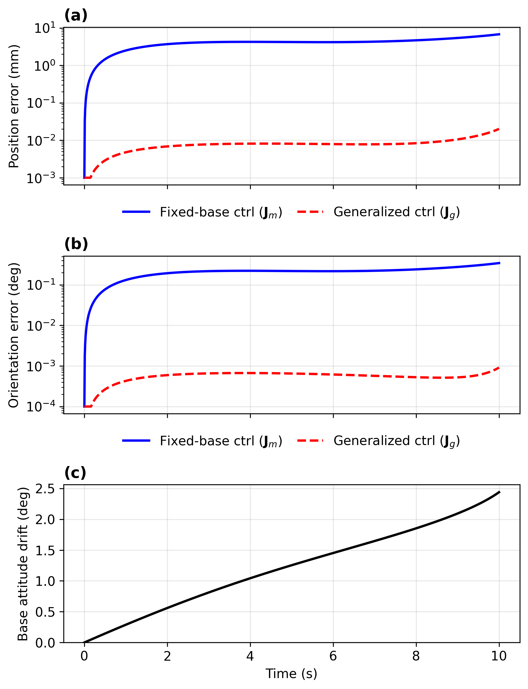

# space-robot-dq

Dual quaternion kinematics and dynamics for free-floating space robot manipulators.

## Overview

`space-robot-dq` is a Python library for modeling N-DOF free-floating space robot manipulators using dual quaternion algebra and screw theory. Unlike ground-based robots, space manipulators have no fixed base. When the arm moves, the spacecraft reacts to conserve momentum. This library captures that dynamic coupling through the generalized Jacobian framework.

<p align="center">
  
</p>
<p align="center"><em>Station-keeping against a client tumbling at 5&deg;/s: the generalized-Jacobian controller (red) holds the grasp-ready pose ~500&times; more accurately than a controller that ignores the free-floating coupling (blue), while the spacecraft base drifts 2.4&deg; (bottom). Reproduce with <code>python examples/generate_paper_figures.py</code>.</em></p>

## Authors

- **Hadi Jahanshahi** — Department of Mechanical Engineering, York University (<hadij@yorku.ca>, <jahansha@yorku.ca>)
- **Zheng H. Zhu** — Department of Mechanical Engineering, York University (<gzhu@yorku.ca>)

## Key Features

- **Dual quaternion pose representation**: singularity-free, compact, and efficient
- **Product of Exponentials (PoE) forward kinematics**: clean screw-theoretic formulation
- **Arbitrary N-DOF serial chains**: define any robot via `JointDef` and `RobotConfig`
- **Built-in presets**: 7-DOF SRS, 6-DOF standard, and 3-DOF planar
- **6-DOF inverse kinematics**: position + orientation with configurable weights
- **Numerical and analytical Jacobians**: validated against each other
- **Momentum conservation**: computes base reaction to manipulator motion
- **Generalized Jacobian**: maps joint velocities to end-effector velocity accounting for base coupling (Umetani & Yoshida, 1989)
- **Dynamic manipulability**: quantifies velocity capability under free-floating constraints
- **Resolved-rate control** *(new in v0.3.0)*: closed-loop Cartesian tracking on the free-floating plant with the generalized Jacobian, with null-space posture control and momentum-conserving base propagation
- **Base attitude drift analysis** *(new in v0.3.0)*: quantifies spacecraft pointing loss caused by arm motion
- **Tumbling-target pose tracking** *(new in v0.3.0)*: 6-DOF station-keeping against a tumbling client with dual-quaternion pose error (capture-approach scenario)
- **Lightweight**: depends only on NumPy and SciPy (PyTorch is an optional extra)

## Installation

```bash
# From source
git clone https://github.com/HJahanshahi/space-robot-dq.git
cd space-robot-dq
pip install -e .

# With development dependencies
pip install -e ".[dev]"

# With examples (matplotlib, jupyter)
pip install -e ".[examples]"

# With optional PyTorch tensor support
pip install -e ".[torch]"
```

## Reproducing the Paper Figures

```bash
pip install matplotlib
python examples/generate_paper_figures.py
```

This deterministically regenerates every figure of the accompanying paper
and prints all cited numbers. Validation:

```bash
pytest                              # 153 unit tests
python benchmarks/run_benchmarks.py # 19 benchmark checks
```

## Quick Start

### Using the default 7-DOF SRS robot

```python
from space_robot_dq import SpaceRobotKinematics, SpaceRobotDynamics
import numpy as np

# Default 7-DOF SRS manipulator
kin = SpaceRobotKinematics()

# Position only
q = [0, 0.3, 0, 1.2, 0, -0.4, 0]
position = kin.forward_kinematics(q)

# Full 6-DOF pose
position, quaternion = kin.forward_kinematics_6dof(q)
# quaternion is [w, x, y, z]
```

### Defining a custom robot

Any serial chain of revolute joints can be defined using `RobotConfig` and `JointDef`:

```python
from space_robot_dq import RobotConfig, JointDef, SpaceRobotKinematics

config = RobotConfig(
    joints=[
        JointDef(axis=[0,0,1], position=[0,0,0],   name="yaw"),
        JointDef(axis=[0,1,0], position=[0,0,0.3], name="pitch1"),
        JointDef(axis=[0,1,0], position=[0,0,0.6], name="pitch2"),
        JointDef(axis=[1,0,0], position=[0,0,0.9], name="roll"),
    ],
    ee_position=[0, 0, 1.1],
    name="Custom 4-DOF Arm",
)

kin = SpaceRobotKinematics(config)
pos, quat = kin.forward_kinematics_6dof([0.5, 0.3, 0.8, 0.2])
```

### Inverse kinematics

```python
# Position-only IK
target_pos = np.array([0.4, 0.2, 0.5])
q_solution = kin.inverse_kinematics(target_pos)

# 6-DOF IK (position + orientation)
target_quat = np.array([1, 0, 0, 0])  # [w, x, y, z]
q_solution = kin.inverse_kinematics_6dof(
    target_pos, target_quat,
    position_weight=10.0,
    orientation_weight=2.0,
)
```

### Momentum conservation and generalized Jacobian

```python
from space_robot_dq import SpaceRobotDynamics

dyn = SpaceRobotDynamics(kinematics=kin, base_mass=100.0)

q = np.array([0, 0.3, 0, 1.2, 0, -0.4, 0])
qdot = np.array([0.1, 0.05, 0, -0.1, 0, 0, 0])

# Base reacts to conserve momentum
base_velocity = dyn.compute_base_velocity(q, qdot)
# base_velocity = [v_x, v_y, v_z, w_x, w_y, w_z]

# Generalized Jacobian (accounts for base reaction)
J_g, J_m, J_b = dyn.compute_generalized_jacobian(q)

# End-effector velocity accounting for coupling
ee_velocity = J_g @ qdot  # differs from J_m @ qdot

# Dynamic manipulability
w_free, w_fixed = dyn.compute_dynamic_manipulability(q)
print(f"Free-floating: {w_free:.4f}, Fixed-base: {w_fixed:.4f}")
```

### Custom mass properties

```python
from space_robot_dq import LinkProperties

# Using per-link mass properties
dyn = SpaceRobotDynamics(
    kinematics=kin,
    base_mass=200.0,
    base_inertia=np.diag([20.0, 20.0, 15.0]),
    link_properties=[
        LinkProperties(mass=5.0, com_home=[0, 0, 0.15], inertia=np.diag([0.1]*3)),
        LinkProperties(mass=3.0, com_home=[0, 0, 0.45], inertia=np.diag([0.05]*3)),
        # ... one per joint
    ],
)

# Or using the legacy API with a mass list
dyn = SpaceRobotDynamics(
    kinematics=kin,
    base_mass=200.0,
    link_masses=[4, 2, 8, 2, 7, 2, 3],
)
```

## Built-in Robot Presets

| Preset | DOF | Description |
|--------|-----|-------------|
| `create_7dof_srs()` | 7 | Spherical-Revolute-Spherical space manipulator (default) |
| `create_6dof_standard()` | 6 | Standard industrial-style manipulator |
| `create_3dof_planar()` | 3 | Planar manipulator for testing and education |

```python
from space_robot_dq import create_3dof_planar, SpaceRobotKinematics

kin = SpaceRobotKinematics(create_3dof_planar())
print(kin.num_joints)  # 3
```

## Default 7-DOF SRS Robot

The default robot is a 7-DOF SRS (Spherical-Revolute-Spherical) manipulator:

| Joint | Name | Axis | Location (home) |
|-------|------|------|-----------------|
| J0 | Shoulder yaw | z | Origin |
| J1 | Shoulder pitch | y | [0, 0, 0.310] |
| J2 | Shoulder roll | x | [0, 0, 0.310] |
| J3 | Elbow pitch | y | [0, 0, 0.710] |
| J4 | Forearm roll | x | [0, 0, 0.710] |
| J5 | Wrist pitch | y | [0, 0, 1.100] |
| J6 | Wrist roll | x | [0, 0, 1.100] |

End-effector at home configuration: [0, 0, 1.178] m

## API Reference

### Robot Configuration

| Class | Description |
|-------|-------------|
| `JointDef(axis, position, name, q_min, q_max)` | Definition of a single revolute joint |
| `RobotConfig(joints, ee_position, ee_orientation, name)` | Complete robot configuration |
| `LinkProperties(mass, com_home, inertia)` | Mass properties for a single link |

### SpaceRobotKinematics

| Method | Returns | Description |
|--------|---------|-------------|
| `forward_kinematics(q)` | (3,) | End-effector position |
| `forward_kinematics_6dof(q)` | (3,), (4,) | Position + quaternion [w,x,y,z] |
| `inverse_kinematics(target_pos)` | (N,) | Position-only IK |
| `inverse_kinematics_6dof(pos, quat)` | (N,) | 6-DOF IK |
| `calculate_jacobian(q)` | (6,N) | Numerical geometric Jacobian |
| `calculate_jacobian_analytical(q)` | (6,N) | Analytical geometric Jacobian |

### SpaceRobotDynamics

| Method | Returns | Description |
|--------|---------|-------------|
| `compute_inertia_matrices(q)` | (6,6), (6,N) | H_b, H_bm |
| `compute_base_velocity(q, qdot)` | (6,) | Base reaction velocity |
| `compute_generalized_jacobian(q)` | (6,N), (6,N), (6,6) | J_g, J_m, J_b |
| `compute_system_momentum(q, qdot, xb_dot)` | (6,) | Total momentum |
| `compute_dynamic_manipulability(q)` | float, float | w_free, w_fixed |
| `compute_system_com(q)` | (3,) | System center of mass |

## Testing

```bash
# Run all tests (153 tests across 4 robot configurations)
pytest

# With coverage
pytest --cov=space_robot_dq

# Run specific module
pytest tests/test_dynamics.py -v
```

## Theory

The library implements the space-frame Product of Exponentials formulation:

$$T_{ee} = T_{base} \cdot \prod_{i=0}^{n-1} e^{S_i q_i} \cdot M$$

where $S_i$ are the screw axes and $M$ is the home configuration.

For free-floating systems, momentum conservation gives:

$$H_b \dot{x}_b + H_{bm} \dot{q} = h_0$$

The generalized Jacobian (Umetani & Yoshida, 1989):

$$J_g = J_m - J_b H_b^{-1} H_{bm}$$

maps joint velocities to end-effector velocity accounting for the dynamic coupling between the manipulator and the free-floating base.

## References

- Umetani, Y., & Yoshida, K. (1989). "Resolved motion rate control of space manipulators with generalized Jacobian matrix." IEEE Transactions on Robotics and Automation, 5(3), 303-314.
- Dubowsky, S., & Papadopoulos, E. (1993). "The kinematics, dynamics, and control of free-flying and free-floating space robotic systems." IEEE Transactions on Robotics and Automation, 9(5), 531-543.
- Lynch, K. M., & Park, F. C. (2017). Modern Robotics: Mechanics, Planning, and Control. Cambridge University Press.

## Citing

If you use this library in your research, please cite it (see also `CITATION.cff`):

```bibtex
@software{jahanshahi2026spacerobotdq,
  author  = {Jahanshahi, Hadi and Zhu, Zheng H.},
  title   = {space-robot-dq: A Python Library for Dual Quaternion Kinematics
             and Dynamics of Free-Floating Space Robot Manipulators},
  version = {0.3.0},
  year    = {2026},
  url     = {https://github.com/HJahanshahi/space-robot-dq},
  note    = {Zenodo DOI: to be added upon release}
}
```

A companion paper is under review at *Frontiers in Space Technologies*; this
entry will be updated with the article citation upon publication.

## License

MIT
